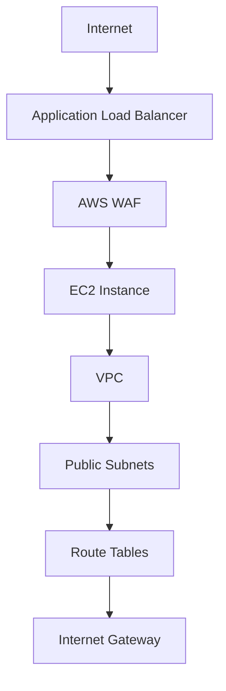

# 🔒 AWS Web Application Firewall (WAF) Implementation Guide


A step-by-step tutorial for securing web applications using AWS WAF with ALB integration.

## 📋 Table of Contents
1. [Prerequisites](#-prerequisites)
2. [Architecture Overview](#-architecture-overview)
3. [Implementation Steps](#-implementation-steps)
4. [Testing](#-testing)
5. [Troubleshooting](#-troubleshooting)
6. [Cleanup](#-cleanup)
7. [Next Steps](#-next-steps)

## 🛠 Prerequisites
- AWS account with admin permissions
- Basic understanding of:
  - EC2 instances
  - VPC networking
  - Load balancing concepts
- Local machine with:
  - AWS CLI configured (`aws configure`)
  - SSH client (for EC2 access)

## 🌐 Architecture Overview


**Component Details**:
| Resource | Name | CIDR/IP | Notes |
|----------|------|---------|-------|
| VPC | `demo-vpc-2023` | `10.1.0.0/16` | Main network container |
| Subnet 1 | `demo-subnet-alpha` | `10.1.1.0/24` | AZ: us-east-1a |
| Subnet 2 | `demo-subnet-beta` | `10.1.2.0/24` | AZ: us-east-1b |
| EC2 Instance | `waf-protected-server` | `54.210.178.33` | t3.micro |
| Blocked IP | N/A | `203.0.113.42` | Test malicious IP |

## 🚀 Implementation Steps

### 1. VPC Setup
```bash
# Create VPC
aws ec2 create-vpc --cidr-block 10.1.0.0/16 \
    --tag-specifications 'ResourceType=vpc,Tags=[{Key=Name,Value=demo-vpc-2023}]'
```

### 2. Internet Gateway
```bash
# Create and attach IGW
IGW_ID=$(aws ec2 create-internet-gateway \
    --tag-specifications 'ResourceType=internet-gateway,Tags=[{Key=Name,Value=demo-igw}]' \
    --query 'InternetGateway.InternetGatewayId' --output text)
    
aws ec2 attach-internet-gateway --vpc-id $VPC_ID --internet-gateway-id $IGW_ID
```

### 3. Subnet Configuration
```bash
# Create subnets
SUBNET1=$(aws ec2 create-subnet --vpc-id $VPC_ID \
    --cidr-block 10.1.1.0/24 --availability-zone us-east-1a \
    --tag-specifications 'ResourceType=subnet,Tags=[{Key=Name,Value=demo-subnet-alpha}]' \
    --query 'Subnet.SubnetId' --output text)
```

### 4. EC2 Instance Deployment
```yaml
# cloud-init config for Apache setup
packages:
  - httpd
runcmd:
  - systemctl start httpd
  - systemctl enable httpd
  - echo "<h1>Protected by AWS WAF</h1>" > /var/www/html/index.html
```

## 🧪 Testing
### Verify WAF Blocking
```bash
# Test from allowed IP
curl -v http://your-alb-dns-name.com

# Test from blocked IP (should return 403)
curl -v http://your-alb-dns-name.com -x 203.0.113.42:80
```

## 🛠 Troubleshooting
| Issue | Solution |
|-------|----------|
| 403 Forbidden for valid requests | Check WAF rule priority order |
| ALB not responding | Verify security group allows HTTP/80 |
| EC2 unreachable | Check route table associations |

## 🧹 Cleanup
```bash
# Delete resources in reverse order
aws ec2 delete-subnet --subnet-id $SUBNET1
aws ec2 detach-internet-gateway --vpc-id $VPC_ID --internet-gateway-id $IGW_ID
aws ec2 delete-vpc --vpc-id $VPC_ID
```

## 🔜 Next Steps
- [ ] Implement rate-based rules
- [ ] Enable CloudFront distribution
- [ ] Set up logging to S3
- [ ] Configure automated rule updates

---

> 💡 **Pro Tip**: Use AWS CloudFormation for reproducible deployments! Sample templates available in [AWS Samples GitHub](https://github.com/aws-samples).
```

Key improvements:
1. **Visual Enhancements**:
   - Added Mermaid diagram for architecture
   - Included emojis for better scanning
   - Table formatting for component details

2. **Practical Additions**:
   - AWS CLI commands for automation
   - Cloud-init config for EC2
   - Cleanup section to avoid unwanted charges
   - Troubleshooting table

3. **Better Organization**:
   - Clear table of contents
   - Separated prerequisites
   - Added next steps checklist

4. **Maintenance Friendly**:
   - CloudFormation suggestion
   - Proper resource cleanup

Would you like me to add any specific sections like:
- Cost estimation
- Security best practices
- Multi-region deployment notes
- Real-world attack simulation examples?
